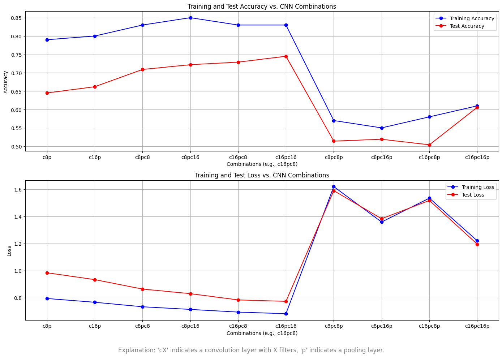

# CNN from Scratch with NumPy

This project demonstrates a complete Convolutional Neural Network (CNN) implementation using only NumPy, applied to the MNIST handwritten digit dataset. This CNN includes core layers—Convolution, Max Pooling, and Softmax—and is trained using backpropagation with cross-entropy loss, fully coded from scratch.

## Project Overview

The project aims to build a functional CNN model to classify handwritten digits from the MNIST dataset. Each layer, including forward and backward propagation (backpropagation), has been implemented with NumPy.

### Key Features
- **Custom CNN Implementation**: Convolutional, Max Pooling, and Softmax layers.
- **Handcrafted Backpropagation**: Implemented for each layer to optimize performance.
- **Training and Testing**: Model trains and tests on the MNIST dataset for digit recognition.
- **Result Visualization**: Graphs depicting accuracy and loss across different configurations.

## Project Structure
```plaintext
|-- main.py               # Main script for training and evaluating the model
|-- convolution.py        # Custom Convolution layer implementation
|-- max_pool.py           # Max Pooling layer implementation
|-- softmax.py            # Softmax layer with cross-entropy loss
|-- comparison.png        # plots comparing accuracy and loss across different configurations
```
## Model Details

### Layers Implemented
- **Convolutional Layer**: 3x3 filter, applied to 2D grayscale images.
- **Max Pooling Layer**: 2x2 pooling for down-sampling and dimensionality reduction.
- **Softmax Layer**: Maps output to a 10-class distribution using cross-entropy loss.

### Backpropagation
Each layer is equipped with backpropagation logic implemented from scratch to calculate gradients and update weights during training.

## Testing Configurations

Multiple CNN configurations were tested by varying the number and arrangement of convolutional and pooling layers. Each configuration’s impact on the training and testing performance was visualized in two graphs:

- **Accuracy vs. Configuration**
- **Loss vs. Configuration**

## Testing Results
